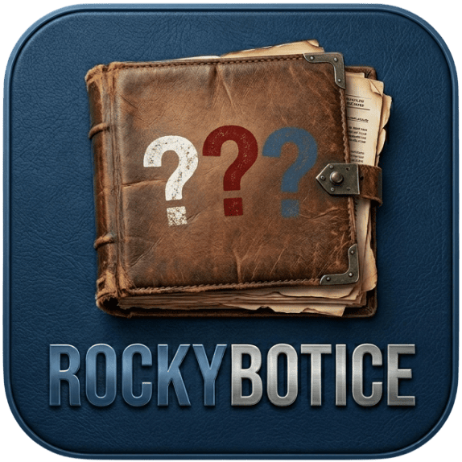

<h1 align="center">
 🔍 RockyBotICE – Die digitale Zentrale
</h1>

  
   
  <b>»Erster Detektiv: Justus Jonas. Zweiter Detektiv: Peter Shaw. Recherchen und Archiv: Bob Andrews.«</b>

---

## 📂 Aktennotiz: Projektübersicht
**RockyBotICE** ist ein automatisierter Ermittlungs-Assistent (Bot) für das Fediverse (Mastodon). Seine Aufgabe ist die tägliche Analyse und Empfehlung von Fällen der legendären Hörspielserie *Die drei ???*. Dieses Repository enthält das Frontend der "Zentrale", über die Ermittler auf Fallakten und Metadaten zugreifen können.

### 🛠 System-Spezifikationen
* **Status:** Aktiv (Ermittlung läuft)
* **Technologie:** PHP 8.x, Alpine.js, Tailwind CSS (Zentrale-Design)
* **Datenquelle:** [dreimetadaten.de](https://dreimetadaten.de)
* **Lizenz:** CC-BY-4.0 license (Zugriff für befugte Detektive gestattet)

---

## 📋 Protokoll & Features
* **Digitale Fallakte:** Detaillierte Ansicht jeder Folge inklusive Inhaltsanalyse und Beweisfoto (Cover).
* **Funk-Schnittstellen:** Direkte Anbindung an Spotify, Apple Music, Deezer & Co.
* **Archiv-Log:** Automatische Erfassung der zuletzt empfohlenen Fälle (`log.json`).
* **Responsives Design:** Optimiert für mobiles Equipment und Desktop-Rechner in der Zentrale.

---

## 🗂️ Quellcode-Archiv & Mirror
Befugte Ermittler können den Code an folgenden Standorten einsehen:
* **GitHub:** [github.com/RonDevHub/RockyBotICE](https://github.com/RonDevHub/RockyBotICE)
* **Codeberg:** [codeberg.org/RonDevHub/RockyBotICE](https://codeberg.org/RonDevHub/RockyBotICE)

---

## ☕ Unterstützung erbeten
Die Instandhaltung der Zentrale erfordert viel schwarzen Kaffee. Wenn dir die Ermittlungsarbeit gefällt, kannst du den Haupt-Ermittler hier unterstützen:

 

---

  <i>Inoffizielles Fan-Projekt. "Die drei ???" ist eine Marke der Franckh-Kosmos Verlags-GmbH & Co. KG.</i> 
  <b>Entwickelt von <a href="https://rondev.de">RonDev</a></b>

